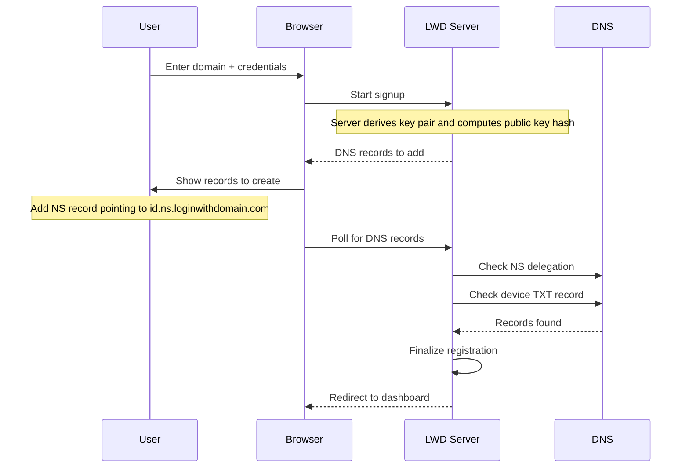

# Sign Up

This guide walks through registering with Login With Domain. Choose the section that applies to you.

---

## Registering your own domain

Use this if you own a domain (e.g. `alice.com`) and want to use it as your LWD identity.

### Prerequisites

- A domain you control
- Access to your domain's DNS settings

### Step 1 — Enter your domain and credentials

Go to [loginwithdomain.com](https://loginwithdomain.com) and click **Sign up**.

Enter your domain name (e.g. `alice.com`) and a strong password. The password must be at least 8 characters.

:::warning
Use a strong, unique password. Your password cannot be reset — if you lose it, you lose access to your identity.
:::

### Step 2 — Add DNS records

After submitting, LWD shows you the DNS records you need to add. There are two options:

#### Option A — Managed DNS (recommended)

Add a single NS record to your DNS zone:

```
_lwd.alice.com   NS   {id}.ns.loginwithdomain.com
```

The `{id}` value shown on screen is a unique token that ties the NS delegation to your signup session — it prevents other users from claiming your domain during setup.

LWD's nameservers manage everything else automatically once this delegation is in place.

:::tip
This NS delegation gives LWD control over the `_lwd.` subdomain only — not your entire domain.
:::

#### Option B — Manual DNS

Add two records yourself:

```
; SP record — delegates the _lwd subdomain to LWD
_lwd.alice.com   NS   {id}.ns.loginwithdomain.com

; Device record — your public key hash
{deviceId}._lwd.alice.com   TXT   "v=lwd1; pk={pkHash}"
```

LWD shows you the exact values to copy-paste. Both records must be present before LWD can verify ownership.

### Step 3 — Wait for verification



LWD polls DNS automatically once you've added the records. This usually takes under a minute, but can take up to 5 minutes depending on your DNS provider.

### Step 4 — Done

Once the records are verified, you're redirected to your dashboard. Your domain is now a registered LWD identity.

---

## Joining a team

If someone has invited you to join their organisation on LWD, you don't need to own a domain. Your identity will be `you@theirdomain.com`.

### Step 1 — Accept the invitation

Open the invitation link you received. It will take you to the LWD signup page pre-filled with your email address.

### Step 2 — Set your credentials

Enter a password (at least 8 characters). No DNS changes are required — the team admin's domain is already set up, and your device record will be added automatically.

Your identity will be `{you}@{theirdomain.com}` (e.g. `alice@company.com`).

### Step 3 — Done

After signing up, you can log in to any LWD-integrated app using your full identity (e.g. `alice@company.com`).

:::note
As a team member, your DNS records are managed by your organisation's LWD account. You cannot independently transfer your identity.
:::

---

## Troubleshooting

**"Domain is already registered"** — Someone has already registered this domain. If it's yours, check your DNS settings for existing `_lwd` records.

**DNS records not found after several minutes** — Double-check the record name and value. Some DNS providers add an extra dot or strip the trailing dot from the hostname.
