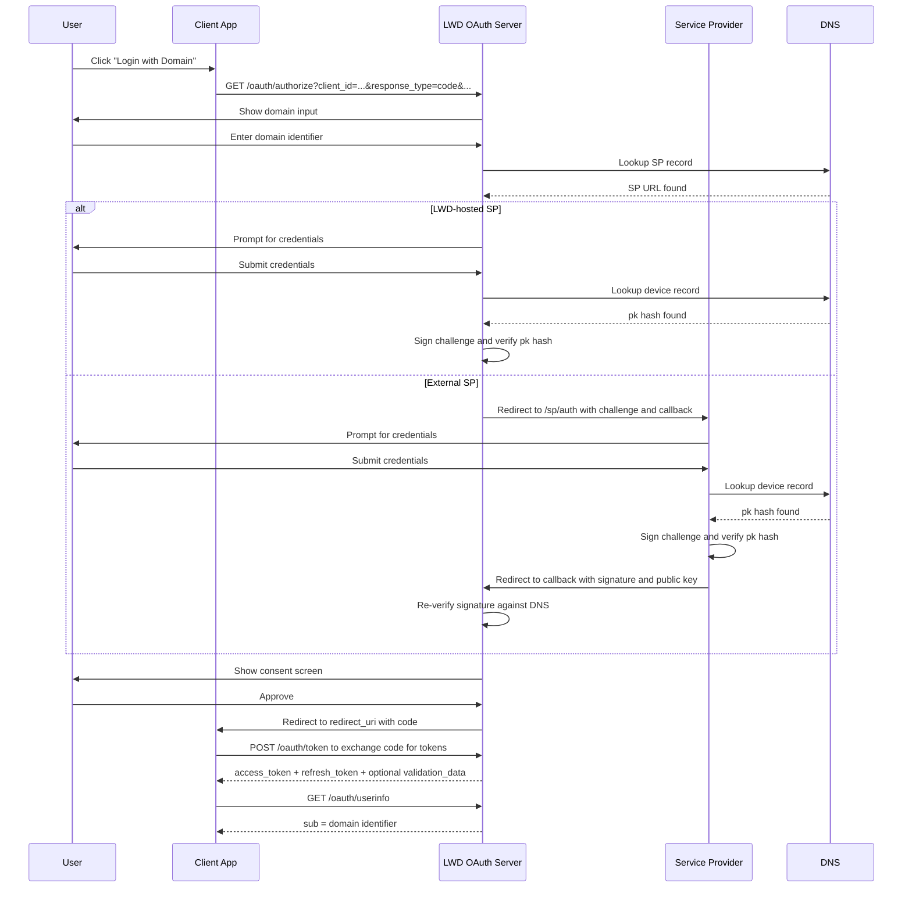

# Authorization Flow

LWD implements the **OAuth 2.0 Authorization Code** flow with optional PKCE support. This is the standard flow for web and mobile apps.

---

## Full flow diagram



---

## Step 1 — Authorization request

Redirect the user to:

```
GET https://auth.loginwithdomain.com/oauth/authorize
  ?client_id=YOUR_CLIENT_ID
  &redirect_uri=https://yourapp.com/callback
  &response_type=code
  &scope=openid
  &state=RANDOM_STATE
  &code_challenge=CODE_CHALLENGE       (PKCE, recommended)
  &code_challenge_method=S256          (PKCE)
```

| Parameter | Required | Description |
|-----------|----------|-------------|
| `client_id` | yes | Your registered client ID |
| `redirect_uri` | yes | Must exactly match a registered URI |
| `response_type` | yes | Always `code` |
| `scope` | yes | Space-separated scopes (e.g. `openid`) |
| `state` | recommended | Opaque value to prevent CSRF |
| `code_challenge` | recommended | PKCE challenge (Base64URL SHA-256 of verifier) |
| `code_challenge_method` | recommended | Always `S256` when using PKCE |

---

## Step 2 — User authenticates

LWD shows a domain input. The user enters their domain. LWD looks up the SP record in DNS and either handles authentication itself or redirects to the external SP.

After authentication, if the app requires consent and the user hasn't granted it before, a consent screen is shown listing the requested scopes.

---

## Step 3 — Authorization code

After consent, LWD redirects back to your `redirect_uri`:

```
https://yourapp.com/callback?code=AUTH_CODE&state=STATE
```

The code expires after **10 minutes**.

---

## Step 4 — Token exchange

Exchange the code for tokens at the token endpoint:

```http
POST /oauth/token
Content-Type: application/x-www-form-urlencoded
Authorization: Basic BASE64(client_id:client_secret)

grant_type=authorization_code
&code=AUTH_CODE
&redirect_uri=https://yourapp.com/callback
&code_verifier=PKCE_VERIFIER
```

See [Token Endpoint](/oauth/token-endpoint) for the full response format.

---

## PKCE

PKCE (Proof Key for Code Exchange) is strongly recommended for all clients, especially public ones (SPAs, mobile apps) that cannot securely store a client secret.

```js
// Generate verifier
const verifier = randomBytes(32).toString("base64url");

// Compute challenge
const challenge = createHash("sha256").update(verifier).digest("base64url");

// Include in authorization request
?code_challenge=CHALLENGE&code_challenge_method=S256

// Include in token exchange
&code_verifier=VERIFIER
```
