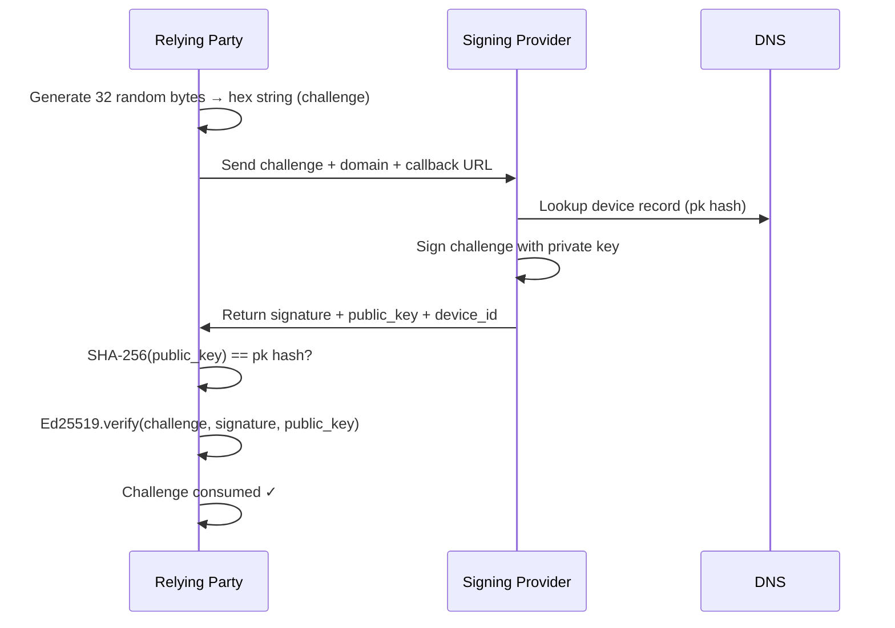

# Challenge Code

The challenge code is the core of LWD's authentication mechanism. It proves that an authentication event is happening right now, not replaying a past one.

---

## What it is

A challenge is a **64-character hexadecimal string** representing 32 random bytes:

```
7f3a1b9c2d4e5f6a8b0c1d2e3f4a5b6c7d8e9f0a1b2c3d4e5f6a7b8c9d0e1f2
```

It is generated fresh for every authentication attempt. The same challenge is never reused.

---

## How it is generated

The challenge is generated by the party that initiates authentication (the relying party or the OAuth server) using a cryptographically secure random number generator. It is passed to the Signing Provider, which signs it.

---

## Lifecycle



1. **Generated** by the relying party before redirecting to the SP.
2. **Passed** in the redirect URL as `?challenge={hex}`.
3. **Signed** by the SP using the private key associated with the domain.
4. **Verified** by the relying party:
   - The public key's SHA-256 hash matches the `pk` field in DNS.
   - The Ed25519 signature over the challenge string is valid.
5. **Discarded** — a challenge is not stored or accepted again after verification.

---

## Why it matters

Without a fresh challenge, an attacker who captured a previous signature could replay it to authenticate as the user later. Because each challenge is unique and single-use, captured signatures are worthless.

---

## Where challenges appear

| Context | Where the challenge is generated |
|---------|--------------------------------|
| OAuth authorization | Generated by the LWD OAuth server before redirecting to the SP |
| Direct SP auth | Generated by the calling application |

In both cases the challenge is passed to the SP via query parameter and returned (as `signed_payload`) in the [`validation_data`](/oauth/validation-data) object.
