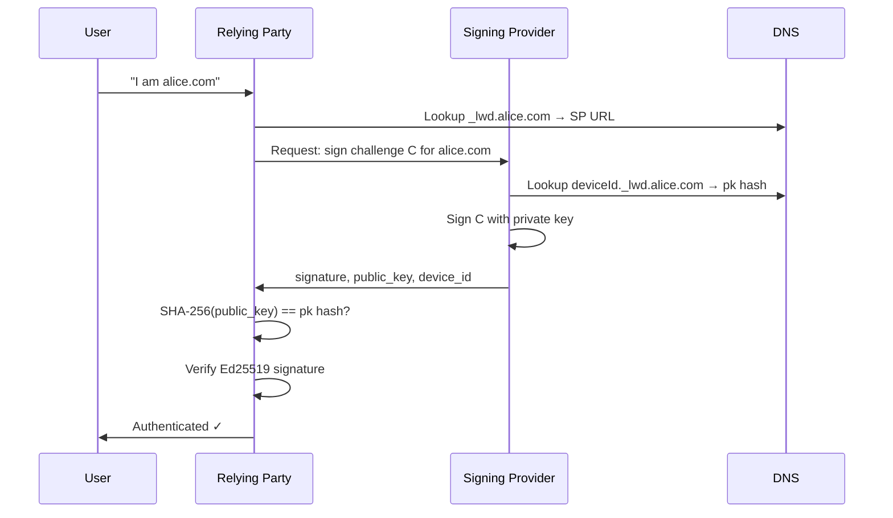

# Protocol Overview

The Login With Domain protocol has three moving parts: **identifiers** (who you are), **DNS records** (proof you control a domain), and **challenge-response signing** (proof you can act as that domain right now).

---

## The three pillars

### 1. Identity = domain

Your identifier is your domain name. There are no usernames, no email addresses, no user IDs. The domain is the user.

```
alice.com
alice@company.com
```

See [Identifiers](/protocol/identifiers) for the full format.

### 2. DNS = public key registry

Two DNS TXT records live under your domain:

- **SP record** (`_lwd.{domain}`) — tells the world which Signing Provider handles authentication for your domain.
- **Device record** (`{deviceId}._lwd.{domain}`) — stores the SHA-256 hash of your public key.

Anyone can look these up. No central registry. No API calls to LWD to check if you're registered.

See [DNS Records](/protocol/dns-records) for the exact format.

### 3. Challenge-response = proof of control

Every authentication attempt uses a fresh, random challenge string. The Signing Provider signs it with the private key associated with your domain. The verifier checks:

1. Is there a device record in DNS for this domain?
2. Does `SHA-256(public_key)` match the `pk` field in that record?
3. Is the Ed25519 signature of the challenge valid for that public key?

If all three pass, the domain owner is authenticated.

See [Challenge Code](/protocol/challenge-code) and [Signing Provider](/protocol/service-provider).

---

## End-to-end flow



---

## What LWD adds on top

The protocol itself is minimal. LWD provides:

- A **hosted Signing Provider** at `sp.loginwithdomain.com` so users don't need to run their own SP
- A **managed DNS service** — delegate `_lwd.yourdomain.com` to LWD's nameservers and we manage your records
- An **OAuth 2.0 / OIDC layer** so any app can integrate with a standard `client_id` + `client_secret` flow
- An optional **`validation_data`** field in tokens so relying parties can independently verify domain ownership
