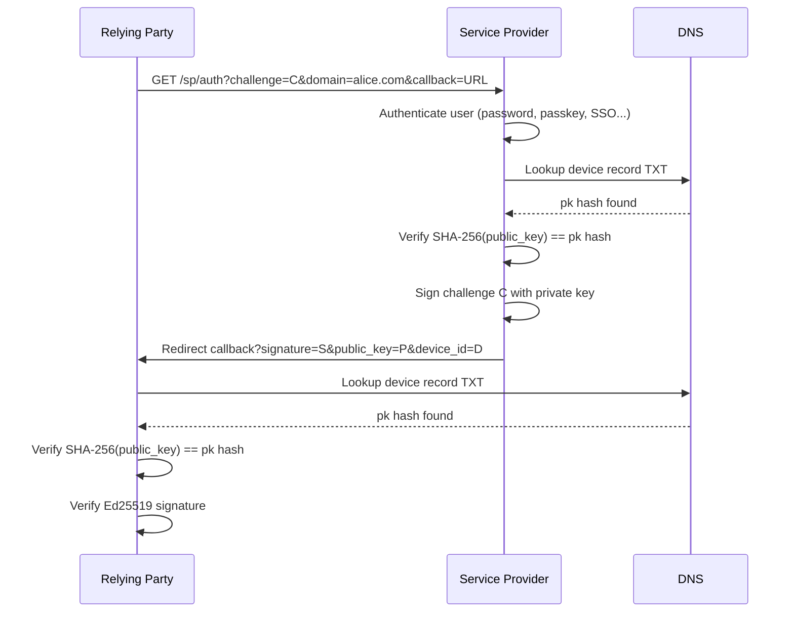

# Service Provider (SP)

A **Service Provider** is a server that performs the cryptographic signing step on behalf of a domain owner. When someone wants to authenticate as `alice.com`, the SP for `alice.com` receives the challenge, signs it, and returns the proof.

---

## SP responsibility

The SP is responsible for ensuring that the user presenting credentials is who they claim to be. The protocol does not prescribe how this is done — it is entirely up to the SP implementation. Common approaches include:

- **Username + password** — the SP verifies the credentials directly.
- **Passkey / WebAuthn** — the user authenticates with a device-bound biometric or PIN.
- **SSO / LDAP** — the SP delegates identity verification to a corporate directory or third-party identity provider.

Whatever method is used, the SP only signs the challenge once it is satisfied the user is legitimate. The relying party does not need to know which method was used.

---

## Role in the protocol

The SP sits between the relying party and the domain's DNS. It:

1. Accepts a challenge, a domain identifier, and a callback URL.
2. Authenticates the user (via password, passkey, SSO, or another method).
3. Looks up the domain's device record in DNS to get the expected public key hash.
4. Signs the challenge with the private key corresponding to that device record.
5. Redirects back to the callback URL with the signature, public key, and device ID.

---

## SP endpoint

Every SP exposes this endpoint:

```
GET /sp/auth?challenge={hex}&domain={identifier}&callback={url}
```

| Parameter | Description |
|-----------|-------------|
| `challenge` | The 64-char hex challenge to sign |
| `domain` | The identifier (e.g. `alice.com` or `alice@company.com`) |
| `callback` | URL to redirect to after signing |

On success the SP redirects to:

```
{callback}?signature={hex}&public_key={hex}&device_id={hex}
```

| Parameter | Description |
|-----------|-------------|
| `signature` | Ed25519 signature of the challenge, hex-encoded |
| `public_key` | The Ed25519 public key used for signing, hex-encoded |
| `device_id` | The 16-char hex device ID |

---

## Challenge signing flow



---

## Finding the SP for a domain

Before sending a challenge, a relying party must find out which SP handles a given domain. It does this by looking up the SP record in DNS:

```
DNS lookup: _lwd.{domain}  TXT
Result:     v=lwd1; sp=https://sp.example.com
```

The `sp` field contains the SP's base URL.

---

## Hosted vs. self-hosted SP

| Option | Description |
|--------|-------------|
| **LWD hosted SP** | `loginwithdomain.com` operates the SP. Users register at `loginwithdomain.com` and their SP record points there. |
| **External SP** | Any server that implements the `/sp/auth` endpoint. The SP record in DNS points to it. |

The protocol is SP-agnostic. A relying party does not need to know which SP it's talking to — it only needs to verify the returned signature against DNS.

---

## Device IDs and the SP

Each identity can have **one or more device IDs**. Each registered device (e.g. each passkey or credential) gets its own device record in DNS. The SP manages which device IDs exist for each identity.

When the SP returns a `device_id`, it is telling the relying party which specific device record to look up.

---

## Verification by the relying party

After the SP redirects back, the relying party must verify independently:

1. **Look up the device record** in DNS using the returned `device_id` and the claimed domain: `{device_id}._lwd.{domain}` (or `{device_id}.{user}._lwd.{domain}` for user-at-domain identifiers). This confirms the device ID actually belongs to that domain.
2. **Check** `SHA-256(public_key) == pk` from the DNS record.
3. **Verify** the Ed25519 signature of the challenge using the public key.

Step 1 ensures the device ID in the DNS record is scoped to the correct domain — an attacker cannot use a device record from a different domain. Step 2 confirms the returned public key matches the registered one. Step 3 confirms the SP signed the correct challenge.
